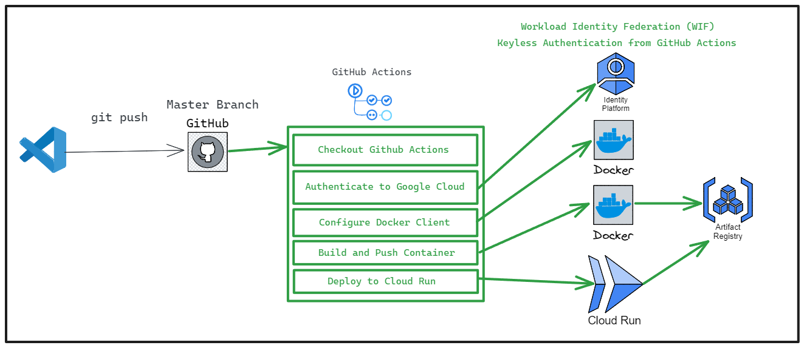
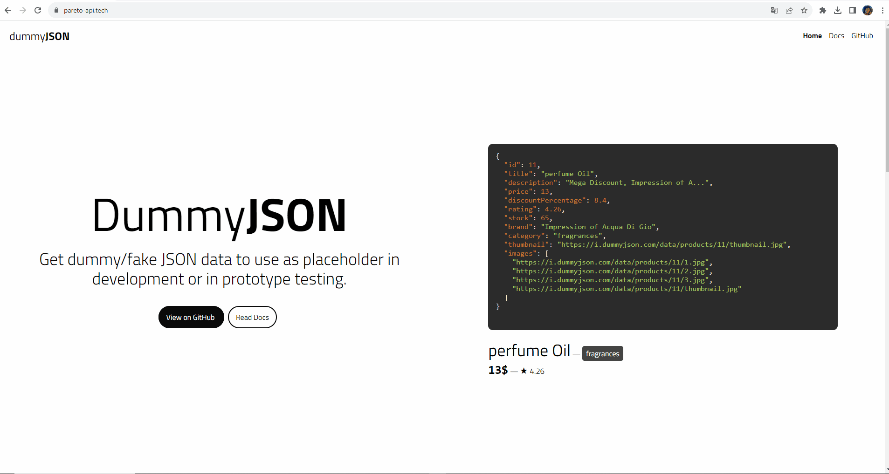

# [pareto-api.tech](https://pareto-api.tech)
Implementation of DummyJSON on Google Cloud Platform via Terraform and with CD integration with Github actions.

In short, DummyJSON is a MOCK API that provides endpoints Endpoints filled with JSON data.

Try it out: https://pareto-api.tech
---

Stack used:

- Terraform
- Github Actions
- Google Cloud Platform (GCP)
  - Google Artifact Registry
  - Google Cloud Run
  - Workload Identity Pools
  - OpenID Connect (OIDC) Identity Provider

## Diagrama da Pipeline

## Site pareto-api.tech funcionando!

<strong>Esquema de diretórios:</strong>

C:.
├───.github
│   └───workflows
├───DummyJSON
│   ├───config
│   ├───public
│   │   ├───css
│   │   │   └───mixin
│   │   ├───highlight.js
│   │   └───js
│   ├───src
│   │   ├───constants
│   │   ├───controllers
│   │   ├───data
│   │   │   └───images
│   │   │       └───products
│   │   │           ├───1
│   │   │           ├───2
│   │   │           ├───3
│   │   │           ├───...
│   │   │           ├───98
│   │   │           ├───99
│   │   │           └───100
│   │   ├───db
│   │   ├───helpers
│   │   ├───middleware
│   │   ├───models
│   │   ├───routes
│   │   └───utils
│   └───views
│       └───partials
└───terraform
    └───.terraform
        ├───modules
        │   └───gh_oidc
        │       ├───.github
        │       │   └───workflows
        │       ├───build
        │       ├───examples
        │       │   ├───gh-org-runner-mig-native-simple
        │       │   ├───gh-runner-gke-dind
        │       │   │   └───sample-manifests
        │       │   ├───gh-runner-gke-simple
        │       │   │   └───sample-manifests
        │       │   ├───gh-runner-mig-container-vm-dind
        │       │   ├───gh-runner-mig-container-vm-simple
        │       │   ├───gh-runner-mig-native-packer
        │       │   ├───gh-runner-mig-native-simple
        │       │   └───oidc-simple
        │       ├───modules
        │       │   ├───gh-oidc
        │       │   ├───gh-runner-gke
        │       │   ├───gh-runner-mig-container-vm
        │       │   └───gh-runner-mig-vm
        │       │       └───scripts
        │       └───test
        │           ├───fixtures
        │           │   ├───gh-runner-gke
        │           │   └───gh-runner-mig-container-vm
        │           ├───integration
        │           │   ├───gh-runner-gke
        │           │   │   └───controls
        │           │   ├───gh-runner-mig-container-vm
        │           │   │   └───controls
        │           │   └───oidc-simple
        │           └───setup
        └───providers
            └───registry.terraform.io
                └───hashicorp
                    ├───google
                    │   └───5.4.0
                    │       └───windows_amd64
                    └───google-beta
                        └───5.4.0
                            └───windows_amd64

## What can be improved?
0. Quality Gate and CI Pipeline
     - [ ] Add a 'Quality Gate', a layer of code review to check if the project has any vulnerabilities in the code or dependencies. (Synk/SonarQube/Trivy are known tools to perform this job)

     - [ ] Add a unit test or integration testing job to further improve the quality and reliability of the code.

1. Configure Bucket to store and maintain Infrastructure Versioning
     - [ ] Configure remote backend in a GCP bucket to store and version the infrastructure states (it's good to prevent accidental data loss)
